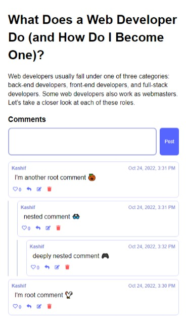

# Full-Stack-Reddit-Comments-Section

An Amazing Full-Stack Reddit Comments-System where you can perform CRUD operations on Comments and Blogs and you can like a specific comment.

# Features
- Create a new comment
- Reply to a comment
- you can only update a comment if you are the owner of the comment
- you can only delete a comment if you are the owner of the comment
- you can like a comment
- you can unlike a comment
- you can only like a comment once
- you can only unlike a comment once
# Technologies
## Front End
- React.js
- React Context Api
- React Router Dom for Navigation
- React Custom Hooks
## Back End
- Fastify  
- Prisma
- PostgresQL
- Cors
- dotenv
- Prisma Client

# Installation
 - Both Fron-End and Back-End servers must be running to run the application

```bash
  clone the redits-comments-system
  cd redits-comments-system
  npm install or yarn add
  npm run start (start the front-end server)
  npm run dev (start the back-end server)
```

## Screenshots


## 🔗 Links

[](https://www.linkedin.com/in/kashif-ali-ba8241196/)
[](https://github.com/jaxkashif34)


## Authors

- [@jaxkashif34](https://github.com/jaxkashif34)